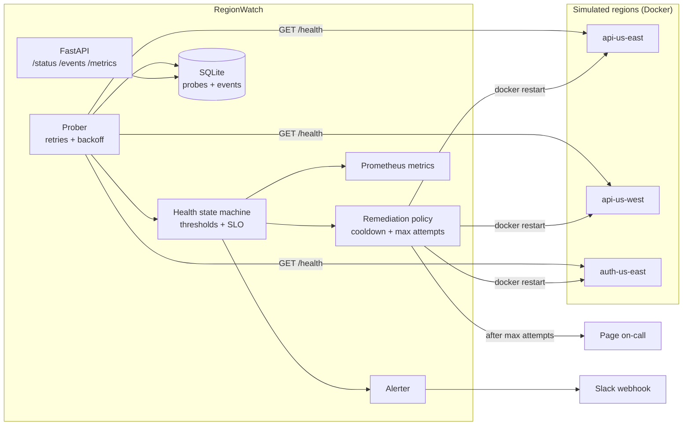

# RegionWatch

**A multi-region health monitor with automatic remediation.** RegionWatch probes services across regions, tracks each one through a health state machine, alerts on changes, and automatically restarts failed services, with cooldowns and attempt caps so the automation can't make an outage worse. When automation runs out of options, it escalates to a human.

It's a small version of what reliability tooling does in a real cloud region: detect, decide, remediate, escalate, and keep a record.


**[Try the live demo →](https://regionwatch-demo.onrender.com)** Break a service and watch it heal itself.

<!-- Add a screenshot of the dashboard here: docs/dashboard.png -->

## Features

- **Concurrent health probes** (asyncio + httpx) with per-target timeouts and **retries with exponential backoff**. 5xx and timeouts are retried; 4xx is not, since retrying a bad path won't fix it.
- **Health state machine** per target, `UNKNOWN → HEALTHY ⇄ DEGRADED → DOWN`, using failure and recovery thresholds to prevent flapping alerts. Responses slower than the latency SLO count as `DEGRADED`.
- **Automatic remediation as code**: restart a Docker container or call an automation webhook, guarded by a **cooldown** and **max attempts**, then **escalation to on-call**.
- **Alerting**: structured logs plus an optional Slack-compatible webhook (`CRITICAL`, `WARNING`, `RESOLVED`, `PAGE`).
- **Observability**: Prometheus metrics at `/metrics` (up, state, latency histogram, transitions, remediations), 1-hour availability and p95 latency per target.
- **REST API + live dashboard**: `/status`, `/targets/{id}/history`, `/events`, `/healthz`, and a dashboard at `/`.
- **Chaos testing**: demo services expose `/chaos/{healthy|slow|failing|crash}` so you can break things on purpose.
- **CI/CD**: GitHub Actions runs lint, tests on Python 3.11/3.12, and Docker builds, plus a smoke test of the whole stack.

## Architecture



## Hosted demo

**Live: https://regionwatch-demo.onrender.com**. It runs on a free tier, so the first visit after a quiet spell takes about a minute to wake up.

A single-container demo (`Dockerfile.demo`) runs the monitor and the three demo services together, with fault-injection buttons on the dashboard. Click **Make it fail** on a service and watch it go `DEGRADED → DOWN`, get auto-remediated, and recover. Every step lands in the event log.

[](https://render.com/deploy?repo=https://github.com/ShrinidhiMane/regionwatch)

A free host has no Docker socket, so this demo remediates through the webhook action: it calls the service's own reset endpoint instead of restarting a container. The detect → remediate → recover loop is the same. Injected faults also expire after `CHAOS_TTL_SECONDS` (60 s), so the shared demo never stays broken. Demo mode is opt-in (`demo_mode: true`), and the fault-injection routes don't exist otherwise.

## Quick start (Docker)

```bash
docker compose up --build
# dashboard: http://localhost:8080

# In another terminal, break a service and watch it recover on its own:
./scripts/chaos.sh api-us-east crash     # container dies -> DOWN -> auto-restart -> HEALTHY
./scripts/chaos.sh api-us-west slow      # latency above SLO -> DEGRADED
./scripts/chaos.sh auth-us-east failing  # 503s -> DOWN -> restart clears the fault
```

## Run locally (no Docker)

```bash
python -m venv .venv && source .venv/bin/activate
pip install -r requirements.txt -r requirements-dev.txt

# three demo services
cd demo_service
SERVICE_NAME=api  REGION=us-east-sim uvicorn app:app --port 8001 &
SERVICE_NAME=api  REGION=us-west-sim uvicorn app:app --port 8002 &
SERVICE_NAME=auth REGION=us-east-sim uvicorn app:app --port 8003 &
cd ..

python -m regionwatch --config config/targets.local.yaml   # http://localhost:8080
```

## Tests

```bash
pytest -q --cov=regionwatch     # 31 tests, ~89% coverage
ruff check .
```

The tests use a fake HTTP transport and a controllable clock, so outage, cooldown, escalation and recovery scenarios run deterministically in under a second.

## Configuration

```yaml
interval_seconds: 3        # how often every target is probed
failure_threshold: 3       # consecutive failures before DOWN
recovery_threshold: 2      # consecutive successes before DOWN -> HEALTHY
latency_slo_ms: 500        # slower than this = DEGRADED
retries: 1                 # retries per probe (exponential backoff)
alert_webhook: https://hooks.slack.com/services/...   # optional

targets:
  - id: api-us-east
    region: us-east-sim
    url: http://api-us-east:8000/health
    remediation:
      action: docker_restart     # none | docker_restart | webhook
      container: rw-api-us-east
      cooldown_seconds: 15
      max_attempts: 3
```

## Design decisions

| Decision | Why |
| --- | --- |
| Thresholds before DOWN / recovery | One failed check is usually noise. Streaks prevent alert and restart flapping. |
| Cooldown + max attempts on remediation | Automation that restarts in a tight loop can turn a small incident into a big one. After the cap, a human decides. |
| Don't retry 4xx | A 404 means the check is misconfigured. Retrying adds load and hides the real problem. |
| Monitor loop never crashes | Every probe, alert and remediation failure is caught and recorded. A monitor that dies during an incident is worse than none. |
| SQLite for history | Zero-ops and enough for one node. Swap for Postgres or a time-series DB to run several monitors. |

## Roadmap

- Deploy to AWS (ECS Fargate + CloudWatch) with Terraform or CDK
- AI incident triage: summarize recent events and logs, suggest a likely cause from runbooks (RAG)
- Leader election so several monitor replicas can run without double-remediating
- Grafana dashboard for the Prometheus metrics

## License

MIT
